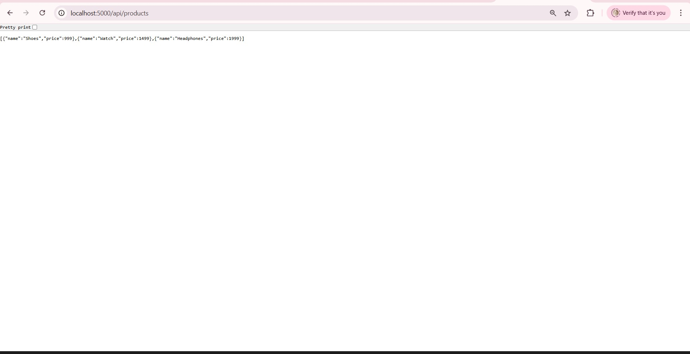
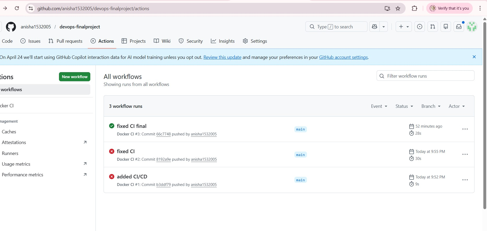
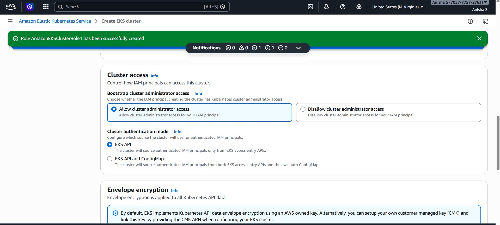
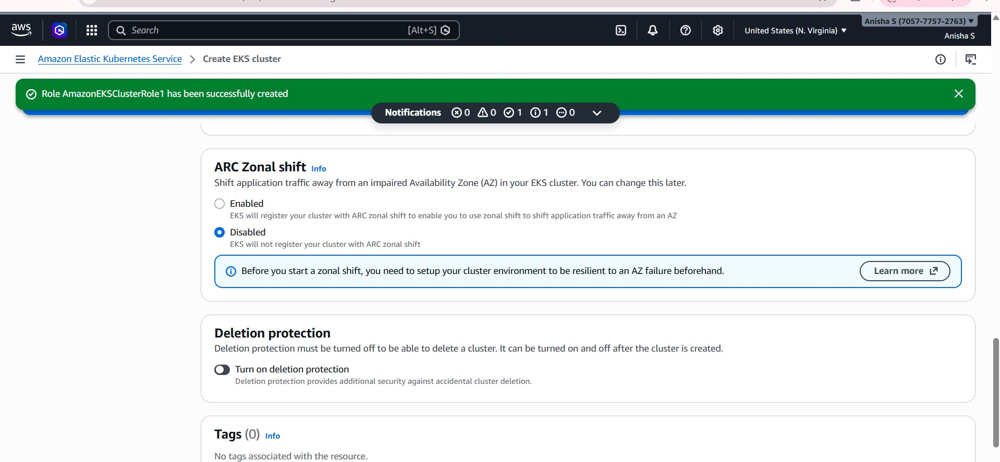
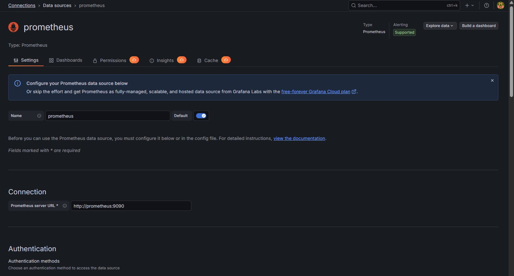

# Microservices DevOps Implementation

## Overview
This documentation describes the implementation of a multi-service application using containerization and Kubernetes, including validation and monitoring evidence.

The implementation covers:
- Container image build and local container validation
- Source control (Git) and repository update
- Kubernetes cluster provisioning (EKS)
- Monitoring verification (Prometheus and Grafana)

---

## Application Endpoints (Local Validation)
- Frontend: `http://localhost:8081`
- Offer page: `http://localhost:8082`
- Backend: `http://localhost:5000`
- Products API: `http://localhost:5000/api/products`

---

## Tools and Components
- Docker (image build, container execution)
- Git and GitHub (version control)
- Kubernetes / EKS (orchestration)
- Prometheus (metrics collection)
- Grafana (metrics visualization)

---

## 1. Repository/Project Directory Validation
A working directory check is performed to confirm the expected files are present before building images.

**Command(s)**
```bash
ls
pwd
```

**Evidence**


---

## 2. Container Image Build (Docker)

### 2.1 Build Images
Container images are built for the services.

**Command(s)**
```bash
# Example pattern (adjust paths/names based on the project layout)
docker build -t frontend:1.0 ./frontend
docker build -t backend:1.0 ./backend
docker build -t offerpage:1.0 ./offerpage
```

**Evidence**


### 2.2 Build Success Confirmation
A successful build output is captured.

**Evidence**


---

## 3. Local Container Execution and Validation

### 3.1 Containers Running
Containers are started and verified.

**Command(s)**
```bash
docker ps

# Example run commands (ports aligned with the provided endpoints)
docker run -d --name backend -p 5000:5000 backend:1.0
docker run -d --name frontend -p 8081:8081 frontend:1.0
docker run -d --name offerpage -p 8082:8082 offerpage:1.0
```

**Evidence**


### 3.2 Frontend Validation
Frontend is verified in the browser.

**Evidence**
  


### 3.3 Backend Validation
Backend service runtime is validated.

**Evidence**


### 3.4 API Validation
The products API endpoint is validated.

**Command(s)**
```bash
curl http://localhost:5000/api/products
```

**Evidence**


---

## 4. Source Control (Git) and Repository Update

### 4.1 Git Repository Status
Repository status is verified prior to staging.

**Command(s)**
```bash
git status
```

**Evidence**


### 4.2 Stage Changes
Changes are staged for commit.

**Command(s)**
```bash
git add .
```

**Evidence**
  


### 4.3 Commit Changes
Changes are committed with a meaningful message.

**Command(s)**
```bash
git commit -m "Add Docker and Kubernetes deployment assets"
```

**Evidence**


### 4.4 Push to Remote Repository
Changes are pushed to the remote repository.

**Command(s)**
```bash
git push origin main
```

**Evidence**


---

## 5. Kubernetes Cluster Provisioning (EKS)

### 5.1 Enable Kubernetes / EKS Setup
Kubernetes is enabled and cluster creation steps are performed.

**Evidence**


### 5.2 Cluster Configuration
Cluster creation form/configuration is captured.

**Evidence**
  


### 5.3 Cluster Creation and Availability
Cluster readiness is captured.

**Evidence**
  


### 5.4 Network Selection / VPC Configuration
Network configuration selection during EKS setup is captured.

**Evidence**


### 5.5 Kubernetes Validation Commands
Cluster connectivity and workloads are validated using kubectl.

**Command(s)**
```bash
kubectl get nodes
kubectl get pods -A
kubectl get svc -A
```

---

## 6. Monitoring Verification (Prometheus and Grafana)

### 6.1 Prometheus Access and Visibility
Prometheus instance availability is captured.

**Evidence**


### 6.2 Prometheus Query Validation
Prometheus successfully queries the application/metrics.

**Evidence**


### 6.3 Grafana Dashboard Validation
Grafana dashboards display metrics for the environment.

**Evidence**


### 6.4 Monitoring Working Evidence
Additional monitoring evidence is captured.

**Evidence**
  


### 6.5 Dashboard Visualizations
Charts/visualizations used for reporting are captured.

**Evidence**
  


---

## Output Summary
- Multi-service application validated locally on the specified ports.
- Changes committed and pushed to GitHub.
- Kubernetes cluster created and validated.
- Monitoring verified with Prometheus and Grafana dashboards.
